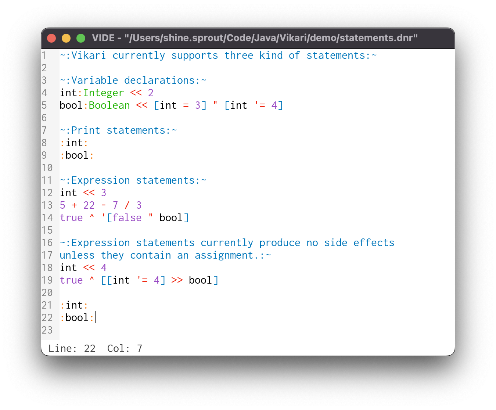

# Vide

Vide is the IDE for [Vikari][0]. Specifically it was designed with the purpose of providing syntax-highlighting for the language. So Vide utilizes the Vikari interpreter directly to lex and parse Vikari source files and support a syntax-highlighting strategy that is backed directly by the interpreter's output.



### Usage

Build the program with Maven. Vikari is a dependency of Vide. So Vikari must be downloaded and built in the `.m2` directory first before Vide will build.

```zsh
# Step 1: install and build Vikari.
cd ~/code/java
git clone https://github.com/atonement-crystals/Vikari.git
cd Vikari
mvn install

# Step 2: Install and build Vide.
cd ~/code/java
git clone https://github.com/atonement-crystals/Vide.git
cd Vide
mvn install

# Execute the jar file directly.
java -jar target/Vide-0.3.0.jar
```

### Aliasing

Suggested usage of Vide is to alias the jar command in `.zshrc`.

```zsh
# Your local root directory for Vide goes here.
VIDE_PROJECT_DIR="~/code/java/Vide"

# Fetch the most recent version of the jar build.
alias vide="java -jar `ls -r ${VIDE_PROJECT_DIR}/target/Vide* | head -n1`"
```

After aliasing Vide, the Vikari demo file as pictured in the screenshot above can be opened with the following command:

```zsh
# Assuming Vikari was downloaded here,
cd ~/code/java/Vikari

# open the demo file for editing.
vide demo/statements.dnr
```

[0]: https://github.com/atonement-crystals/Vikari
